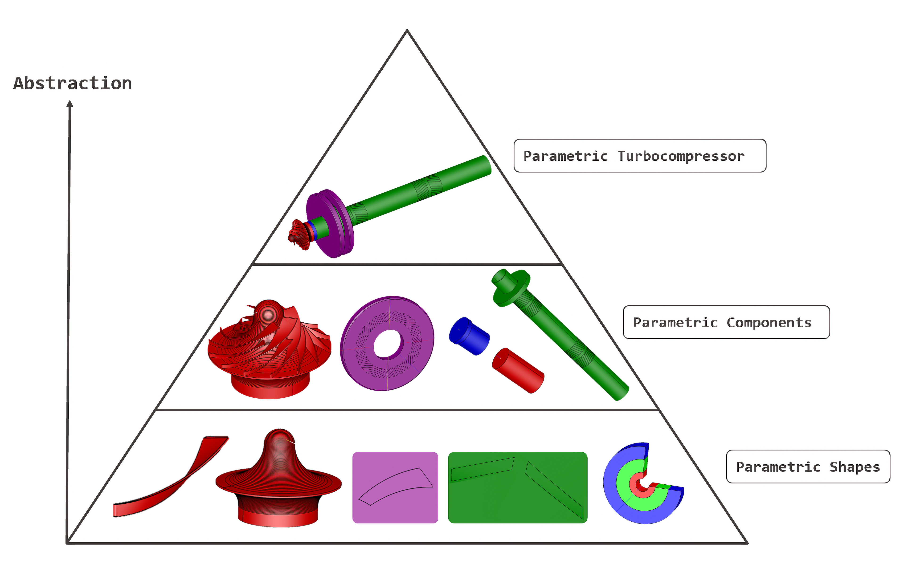

# ParaturboCAD Repository

## Overview
This repository contains the ParaturboCAD library, a comprehensive Python-based tool for the automated visualization and design of gas-bearing supported turbocompressors. Developed as part of ongoing research, this tool leverages CadQuery 2, a scripting CAD platform, to streamline the design process traditionally involving multiple software tools and extensive manual intervention.

## Turbocompressor Component Overview

The image below illustrates the various levels of geometrical abstraction used in the parametric construction of the gas-bearing supported turbocompressor rotor, highlighting the progression from basic parametric shapes to the complete spindle assembly.

### Parametric Construction Hierarchy

- **Parametric Shapes**: The foundation of the modeling process, such as the impeller's blades and hub, and the grooves in the axial and journal bearings.
- **Parametric Components**: Constructed from basic shapes, these include the rotor, magnet, plug, and impeller, each designed with customizable dimensions.
- **Assembly**: The highest abstraction level, where all components are assembled into a fully parametric turbocompressor spindle.




## Citation
If you use this software in your research, please cite it as follows:

Massoudi, S., Bejjani, J., Horvath, T., Üstün, D., Schiffmann, J. (2024). PARATURBOCAD: AUTOMATED PARAMETRIC GEOMETRY CONSTRUCTION FOR GAS-BEARING SUPPORTED TURBOCOMPRESSOR DESIGN WITH PYTHON. Proceedings of the ASME 2024 International Design Engineering Technical Conferences and Computers and Information in Engineering Conference, DETC2024-143696, August 25-28, Washington, District of Columbia. [Software]. Available at [https://github.com/SoheylM/ParaturboCAD](https://github.com/SoheylM/paraturbo-cad).

## Installation

### Prerequisites
- Python 3.9
- Anaconda (Recommended for managing Python packages and environments)

### Steps
1. **Clone the Repository**
```bash
git clone https://github.com/SoheylM/paraturbo-cad.git
cd paraturbo-cad
```


2. **Set up a Python Environment**
```bash
conda create --name paraturbocad python=3.9 git
conda activate paraturbocad
pip install -r requirements.txt
```

## Usage

The ParaturboCAD library is organized into four main classes, each responsible for different aspects of the turbocompressor design:
Classes and Their Functions

    IMPELLER(): Manages the centrifugal impeller design, from parameter extraction to 3D modeling.
    SGTB(): Tailored for designing and modeling Spiral Groove Thrust Bearings.
    ROTOR(): Handles the rotor design process, incorporating Herringbone Grooved Journal Bearings (HGJB).
    HELPER(): Provides utility tools to assist in the assembly of the turbocompressor.

### Running the ParaturboCAD Tool
To generate gas-bearing supported turbocompressors, follow these steps:

1. **Navigate to the Main Folder**:
   - Ensure you are in the directory containing `Turbocompressor_CAD.py`.

2. **Run the Script**:
   - Execute the script using Python. This will read the `Element_CAD.pickle` file located in the `ELEMENT` subfolder of `paraturbo-cad`.
```bash
python Turbocompressor_CAD.py
```

   - The script takes approximately 7 minutes to generate the complete turbocompressor assembly along with all its subsystems as STEP and STL files. 
   The STEP files can be open in any CAD software and the STL files can be used for 3D printing the turbocompressor.

### Modifying Designs

If you wish to explore or generate different designs:

- Visit our dataset on Zenodo to download additional designs:
    Massoudi, S., Bejjani, J., Horvath, T., Üstün, D. and Schiffmann, J. “ParaturboCAD Dataset of R134a HGJB Supported Centrifugal Compressors Optimized Across Varied Mass Flows.” (2024). DOI 10.5281/zenodo.11352178. Available at https://zenodo.org/records/11352178

- This dataset includes over 1000+ designs of turbocompressors.


1. **Use the Downloaded Designs:**:
    - To use a different design, change the import statement in Turbocompressor_CAD.py to reference the desired .pickle file:
```bash
Element = DesignTurbocompressor.importpickle('/path/to/your/downloaded/Element_to_CAD.pickle')
```
    Replace /path/to/your/downloaded/Element_to_CAD.pickle with the actual path to the downloaded and desired .pickle file.

2. **Run the Script**:
   - Execute the script using Python. This will read the `Element_CAD.pickle` file located in the `ELEMENT` subfolder of `paraturbo-cad`.
```bash
python Turbocompressor_CAD.py
```

## Use of cq-editor
Use CadQuery GUI editor based on PyQT that supports Linux, Windows and Mac by running the following command:
```bash
cq-editor
```

## License

This project is licensed under the Apache License 2.0.

## Acknowledgments

    JustinSDK for cqMore
    CadQuery team and contributors for the CadQuery 2 library


